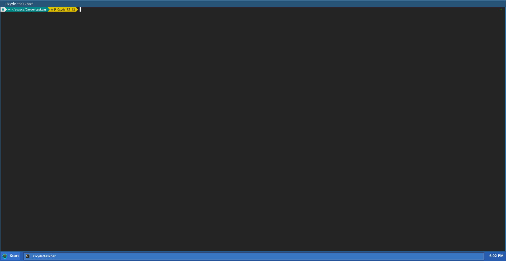

# Oxyde RT  
### Oxyde Retro Technology  

Oxyde RT is a **branch of the Oxyde desktop environment** with a nostalgic twist—bringing back the **retro feel of early 2000s operating systems** without being Windows XP itself.  

---

## ✨ Project Goals
- Deliver a **lightweight, responsive desktop** with a classic XP-style experience.  
- Provide **modern security and driver support** by running on the Linux kernel.  
- Recreate the **look and feel** of early operating systems while keeping performance under tight memory usage.  

---

## 🛠️ Technical Details
- **Core Desktop:** Written in **Rust** for safety and performance.  
- **Taskbar & File Manager:** Implemented in **C/C++** (for fun and to capture the retro coding spirit).  
- **App Drawer:** Pops up with the <kbd>Win</kbd> key, offering quick access to installed applications.  
- **Built-In File Manager:** Fully functional out of the box.  

---

## 📅 Planned Features
- System Settings Manager  
- Resource Monitor  
- Additional lightweight system apps  

---

## Current Progress as of 09/24/2025:
Still Have A Lot to do.....



## ⚠️ Disclaimer
This is **not Windows**.  
Oxyde RT is an **independent project** designed to **recreate the aesthetics and nostalgia** of early 2000s desktops, powered by modern Linux foundations. The choice of C/C++ reflects the retro coding style used in XP-era software, not an attempt at direct compatibility.

---

# Getting started:

## Prerequesities:

### Arch:

```bash
sudo pacman -S base-devel wayland wayland-protocols wayland-utils
```

### Debian / Ubuntu:

```bash
sudo apt install build-essential pkg-config wayland-protocols wayland-scanner libwayland-dev
```

# Testing

### Build task bar

```bash
cc -std=c11 -O2 -Wall -o bar_y2k \
  bar_y2k.c \
  xdg-shell-protocol.c \
  wlr-layer-shell-unstable-v1-protocol.c \
  wlr-foreign-toplevel-management-unstable-v1-protocol.c \
  $(pkg-config --cflags --libs wayland-client cairo)
```

### Test with sway window:

```bash
sudo pacman -S sway
```

```bash
chmod +x taskbar/launch_sway.sh
./taskbar/launch_sway.sh  
```

---

# Taskbar probably wont open yet...

Check log for wayland session number (`wayland-*`)
In `Sway` session:
   Open terminal (`ctrl+alt+t`)

   ```bash
   cd ~/path/to/taskbar
   ```

   ```bash
   cd ~/source/Oxyde/taskbar
   ```

   Run:

   ```bash
   WAYLAND_DISPLAY="wayland-1" ./bar_y2k
   ```

   To stop:

   `Ctrl+C`

 # Alacritty window manager test:

   ```bash
   WAYLAND_DISPLAY="wayland-1" alacritty &
   ```

# Rebuild after any changes